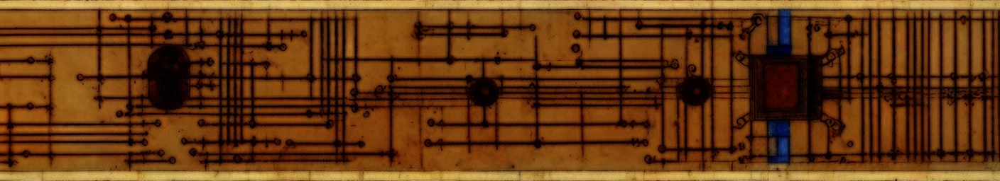

# EasyDoc {.text-center}



---
  
##### _created by:_ {.text-center}
##### [Grandgeorg Websolutions](https://grandgeorg.de)

---

## Install

Download [latest release](https://git.grandgeorg.de/Viktor/easydoc/releases) and unpack it or clone with git:

```bash
# clone via https:
git clone https://git.grandgeorg.de/Viktor/easydoc.git
# or clone via SSH (if you have a key):
git clone git@git.grandgeorg.de:Viktor/easydoc.git
```

Change into `easydoc` directory and run install:

```bash
cd ./easydoc/
npm install
```

You could now use EasyDoc from this directory, but we recommend, that for your documentations in different paths you use the ```setup.js``` from EasyDoc as follows:

```bash
# cd to some directory in some project of yours, where you want to setup your documentation with EasyDoc
cd /some/project/docs
# run setup.js from easydoc with node
node /path/where/you/cloned/and/installed/easydoc/setup.js
# edit newly generated config files (.env, nav.js, package.json - author, description, keywords) in /some/project/docs ...
# put some md-files into docs directory
# you can now run
npm run build
# if you also want to use nodemon to watch your file changes first run
npm install
# then you can run
npm run watch
```

## Usage

```bash
# watches on file changes and runs build:
npm run watch
# or build one time
npm run build
```

--------------------------------------------------------------------------------
- Find more information in the [EasyDoc manual](manual/easydoc.html).  
- For configuration and further usage refer to the [EasyDoc reference](manual/easydoc-reference.html).

If you are reading this in the repository use the links to the markdown files:

- [EasyDoc manual](manual/easydoc.md)  
- [EasyDoc reference](manual/easydoc-reference.md)
--------------------------------------------------------------------------------