# EasyDoc Reference {.text-center}

🔴🔵 {.text-center}

---

## Configuration

### 📄 Global Configuration 
##### ```.env``` file

```ini
EASYDOC_LANG_FALLBACK=en
EASYDOC_TITLE_FALLBACK=Documentation

EASYDOC_BRAND_URL=https://grandgeorg.de
EASYDOC_BRAND_NAME=Grandgeorg
EASYDOC_BRAND_SECONDARY=Websolutions

EASYDOC_TOC_INCLUDELEVEL=[1,2,3,4]

# EASYDOC_DISABLE_BRAND=true
# EASYDOC_DISABLE_TOC=true
# EASYDOC_DISABLE_SITE_NAV=true
# EASYDOC_DISABLE_TAG_NAVIGATOR=true
# EASYDOC_DISABLE_NAVIGATION_BAR=true
# EASYDOC_ENABLE_FULLTEXT_SEARCH=false
# EASYDOC_SEARCH_API_URL=http://localhost:3000
# EASYDOC_LOAD_VUEJS=false
# EASYDOC_LOAD_MERMAID=false
```

### 📄 Per page overrides in front matter
##### ```docs/*.md``` files

```none
---
lang: de
title: Page Title
tags:
  - tag1
  - tag2
brandURL: https://domain.tld
brandName: My Project
brandSecondary: Reserach
tocIncludeLevel: [1, 2, 3, 4]
# disableBrand: true
# disableToc: true
# disableSiteNav: true
# disableTagNavigator: true
# disableNavigationBar: true
# loadVueJs: true
# loadMermaid: true
---
```

:::details Configuration parameters

```.env: EASYDOC_LANG_FALLBACK``` | ```frontmatter: lang```
: Language of the document and EsayDoc language (see ```lang/langs.js```)

```.env: EASYDOC_TITLE_FALLBACK``` | ```frontmatter: title```
: Title of the document

```.env: EASYDOC_BRAND_URL``` | ```frontmatter: brandURL```
: URL the brand link should point to.

```.env: EASYDOC_BRAND_NAME``` | ```frontmatter: brandName```
: Main brand claim string (default style in red).

```.env: EASYDOC_BRAND_SECONDARY``` | ```frontmatter: brandSecondary```
: Secondary brand claim string (default style in blue).

```.env: EASYDOC_TOC_INCLUDELEVEL``` | ```frontmatter: tocIncludeLevel```
: Header include level for table of contents.

```.env: EASYDOC_DISABLE_BRAND``` | ```frontmatter: disableBrand```
: Disable brand claim and link in navbar and footer.

```.env: EASYDOC_DISABLE_TOC``` | ```frontmatter: disableToc```
: Disable table of contents.

```.env: EASYDOC_DISABLE_SITE_NAV``` | ```frontmatter: disableSiteNav```
: Disable site navigation.

```.env: EASYDOC_DISABLE_TAG_NAVIGATOR``` | ```frontmatter: disableTagNavigator```
: Disable tag navigator.

```.env: EASYDOC_DISABLE_NAVIGATION_BAR``` | ```frontmatter: disableNavigationBar```
: Completely disable the navigation bar.

```.env: EASYDOC_ENABLE_FULLTEXT_SEARCH```
: Enable fulltext search with Elasticlunr.js

```.env: EASYDOC_SEARCH_API_URL```
: URL of the search API to use for fulltext search.

```.env: EASYDOC_LOAD_VUEJS``` | ```frontmatter: loadVueJs```
: Load VueJs.

```.env: EASYDOC_LOAD_MERMAID``` | ```frontmatter: loadMermaid```
: Load MermaidJs for flowcharts and diagrams.

```frontmatter: tags```
: Tags for the page, used in tag navigator and search.
:::

### 📄 Site Navigation
Define individual menu items for site navigation.

##### ```nav.js``` example file
```js
exports.nav = [
  {
    "title": "Easydoc",
    "url": "easydoc.html",
  },
  {
    "title": "Some Title",
    "url": "some-URL",
  }
];
```

::: details 🖿 easydoc directory structure
```filetree
🗁 easydoc
 ├🗀 .git
 ├🗀 .vscode
 ├🟢 docs
 │ └🗏 index.md 🖤
 ├🗀 lang 🖊️
 ├🗁 manual 📌
 │ ├🗀 assets
 │ ├🗀 img
 │ ├🗏 easydoc.html
 │ ├🗏 easydoc.md
 │ ├🗏 easydoc-reference.html
 │ └🗏 easydoc-reference.md 
 ├🗀 node_modules
 ├🗀 setup 🖊️
 ├🗀 src 🖊️
 ├🗀 templates 🖊️
 ├🔵 www
 │ ├🗀 assets 🖊️
 │ ├🟢 img
 │ ├🗏 index.html 🖤
 │ └🗏 meta.js 🖤
 ├🗏 .env ✏️
 ├🗏 .gitignore
 ├🗏 .hintrc
 ├🗏 index.js 🖊️
 ├🗏 nav.js ✏️
 ├🗏 nodemon.json
 ├🗏 package.json
 ├🗏 package-lock.json
 └🗏 webpack.config.js

╭──────────────────────────═━┈💬┈━═──────────────────────────╮
│  🟢 input directories. Start creating files here.          │
│  🔵 output directory. Html files will be generated here.   │
│  ✏️ configure EasyDoc                                      │
│  🖊️ change EasyDoc                                         │
│  📌 It's me. You are reading these documents right now.    │
│  🖤 Remove these documentation files for a blank start.    │
╰──────────────────────────═━┈💬┈━═──────────────────────────╯
```
:::

## Markdown

### Typography & Elements

:::details Typographic replacements
(c) (C) (r) (R) (tm) (TM) +-  
ellipsis .. ellipsis ... ellipsis ..... ellipsis ..... ellipsis ....  
!!!!!! ???? ,,  -- ---  
"Smartypants, double quotes" and 'single quotes'  
```markdown
(c) (C) (r) (R) (tm) (TM) +-  
ellipsis .. ellipsis ... ellipsis ..... ellipsis ..... ellipsis ....  
!!!!!! ???? ,,  -- ---  
"Smartypants, double quotes" and 'single quotes'
```
:::

:::details Emphasis
**This is bold text**  
__This is bold text__  
*This is italic text*  
_This is italic text_  
~~Strikethrough~~
```markdown
**This is bold text**  
__This is bold text__  
*This is italic text*  
_This is italic text_  
~~Strikethrough~~
```
:::

:::details Blockquotes
> Blockquotes can also be nested...
>> ...by using additional greater-than signs right next to each other...
> > > ...or with spaces between arrows.
```markdown
> Blockquotes can also be nested...
>> ...by using additional greater-than signs right next to each other...
> > > ...or with spaces between arrows.
```
:::

#### 
:::details Unordered lists
+ Create a list by starting a line with `+`, `-`, or `*`
+ Sub-lists are made by indenting 2 spaces:
  - Marker character change forces new list start:
    - Ac tristique libero volutpat at
    * Facilisis in pretium nisl aliquet
    - Nulla volutpat aliquam velit
+ Very easy!

```markdown
+ Create a list by starting a line with `+`, `-`, or `*`
+ Sub-lists are made by indenting 2 spaces:
  - Marker character change forces new list start:
    - Ac tristique libero volutpat at
    * Facilisis in pretium nisl aliquet
    - Nulla volutpat aliquam velit
+ Very easy!
```
:::

:::details Ordered lists
1. Lorem ipsum dolor sit amet
2. Consectetur adipiscing elit

Lists can be interrupted and then resumed

3. Integer molestie lorem at massa
4. Ac tristique libero volutpat at
    1. sub in enim justo
    2. sub venenatis vitae
    3. sub consequat vitae
5. Facilisis in pretium nisl aliquet
6. Nulla volutpat aliquam velit

Start numbering with offset:

18. scelerisque ut mollis sed
19. faucibus orci luctus

```markdown
1. Lorem ipsum dolor sit amet
2. Consectetur adipiscing elit

Lists can be interrupted and then resumed

3. Integer molestie lorem at massa
4. Ac tristique libero volutpat at
    1. sub in enim justo
    2. sub venenatis vitae
    3. sub consequat vitae
5. Facilisis in pretium nisl aliquet
6. Nulla volutpat aliquam velit

Start numbering with offset:

18. scelerisque ut mollis sed
19. faucibus orci luctus
```
:::


:::details Definition lists

Some Definition Title 1
: Type: `string`
: Default: `empty`
: Some description

Some Definition Title 2
: Type: `bool`
: Default: `true`
: Some description  
with lazy continuation.

_Other style:_

Term 1
  ~ Definition 1a
  ~ Definition 1a

Term 2
  ~ Definition 2a
  ~ Definition 2b

```markdown
Some Definition Title 1
: Type: `string`
: Default: `empty`
: Some description

Some Definition Title 2
: Type: `bool`
: Default: `true`
: Some description  
with lazy continuation.

_Other style:_

Term 1
  ~ Definition 1a
  ~ Definition 1b

Term 2
  ~ Definition 2a
  ~ Definition 2b
```
:::

:::details Tables

| Option | Description | active |
| ------ | ----------- |:------:|
| data   | path to data files to supply the data that will be passed into templates. | ✅ |
| engine | engine to be used for processing templates. Handlebars is the default. | ❌ |
| ext    | extension to be used for dest files. | ✅ |

Right aligned columns

| Option | Description | active |
| ------:| -----------:|:------:|
| data   | path to data files to supply the data that will be passed into templates. | ✅ |
| engine | engine to be used for processing templates. Handlebars is the default. | ❌ |
| ext    | extension to be used for dest files. | ❌ |

```markdown
| Option | Description | active |
| ------ | ----------- |:------:|
| data   | path to data files to supply the data that will be passed into templates. | ✅ |
| engine | engine to be used for processing templates. Handlebars is the default. | ❌ |
| ext    | extension to be used for dest files. | ✅ |

Right aligned columns

| Option | Description | active |
| ------:| -----------:|:------:|
| data   | path to data files to supply the data that will be passed into templates. | ✅ |
| engine | engine to be used for processing templates. Handlebars is the default. | ❌ |
| ext    | extension to be used for dest files. | ❌ |
```
:::

:::details Links
[metager](https://metager.de/)  
[metager with title](https://metager.de/ "MetaGer")  
Autoconverted link https://grandgeorg.de  
```markdown
[metager](https://metager.de/)  
[metager with title](https://metager.de/ "MetaGer")  
Autoconverted link https://grandgeorg.de  
```
:::

:::details Images
##### Fullsize {.text-center}

##### Small with title {.text-center}

```markdown
##### Fullsize {.text-center}

##### Small with title {.text-center}

```
:::

### Markdown Plugins

:::details flowcharts {.closeOnLoad data-open="true"}

Refer to the documentation from [flowchart.js](https://flowchart.js.org/)

#### Example 1

@flowstart
st=>start: Start
e=>end: The End
op1=>operation: My Operation|current
sub1=>subroutine: My Subroutine
cond=>condition: Has option?
io=>inputoutput: catch something...

st->op1->cond
cond(yes)->io->e
cond(no)->sub1(right)->op1
@flowend

#### Example 2

@flowstart
st=>start: Start:>https://grandgeorg.de[blank]
e=>end:>https://grandgeorg.de
op1=>operation: My Operation
sub1=>subroutine: My Subroutine
cond=>condition: Yes
or No?:>https://grandgeorg.de
io=>inputoutput: catch something...
para=>parallel: parallel tasks

st->op1->cond
cond(yes)->io->e
cond(no)->para
para(path1, bottom)->sub1(right)->op1
para(path2, top)->op1
@flowend

```markdown
#### Example 1

@flowstart
st=>start: Start
e=>end: The End
op1=>operation: My Operation|current
sub1=>subroutine: My Subroutine
cond=>condition: Has option?
io=>inputoutput: catch something...

st->op1->cond
cond(yes)->io->e
cond(no)->sub1(right)->op1
@flowend

#### Example 2

@flowstart
st=>start: Start:>https://grandgeorg.de[blank]
e=>end:>https://grandgeorg.de
op1=>operation: My Operation
sub1=>subroutine: My Subroutine
cond=>condition: Yes
or No?:>https://grandgeorg.de
io=>inputoutput: catch something...
para=>parallel: parallel tasks

st->op1->cond
cond(yes)->io->e
cond(no)->para
para(path1, bottom)->sub1(right)->op1
para(path2, top)->op1
@flowend
```
:::

:::details mermaid {.closeOnLoad data-open="true"}

Refer to the documentation from [Mermaid](https://mermaid.js.org/)

#### Flowchart - Network Diagram - Theme "dark" (default in easydocs)

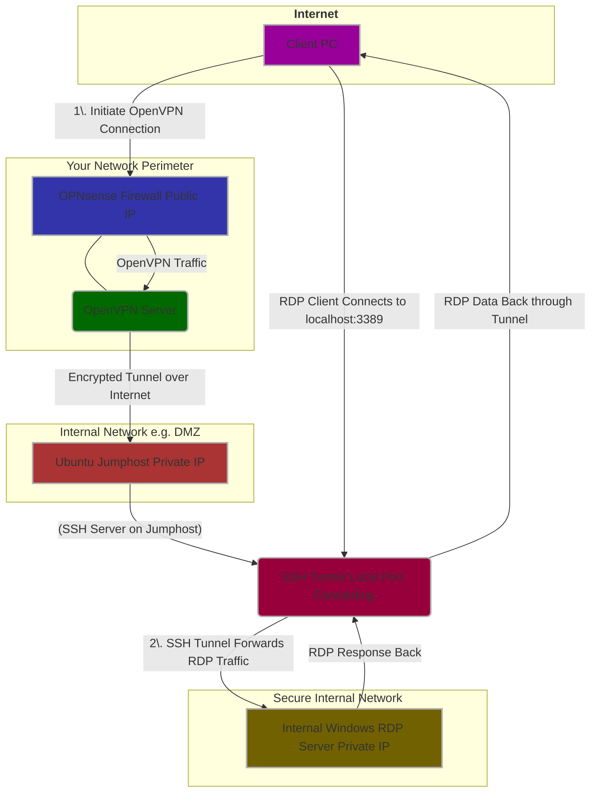

#### Flowchart - Network Diagram - Theme "default"

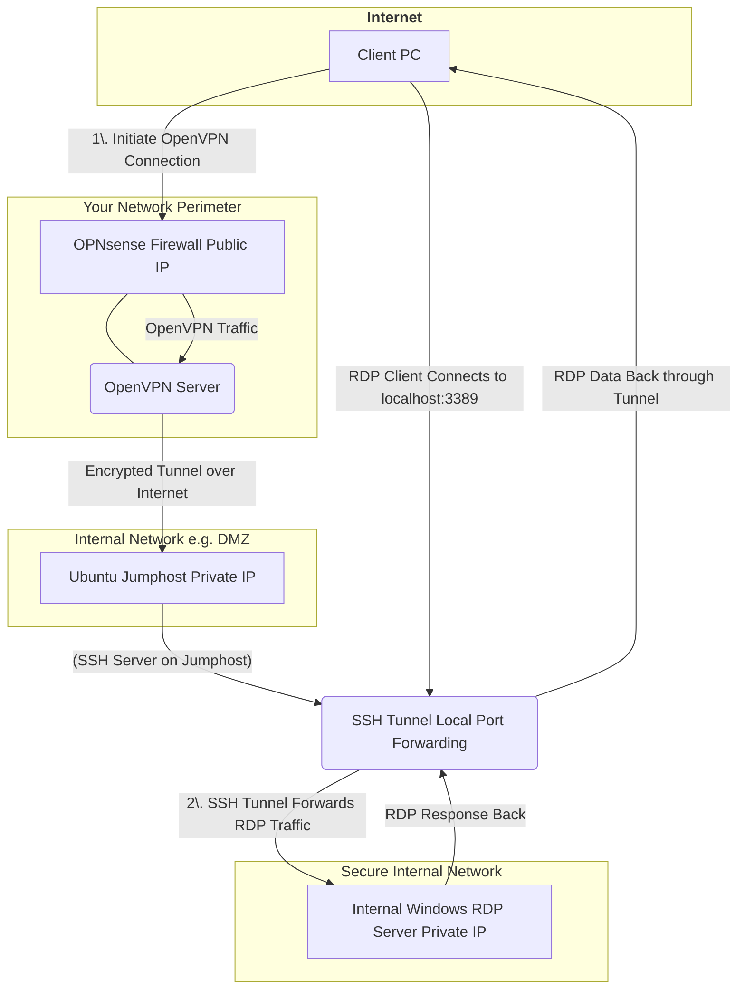
<style>
  #mermaid-network-diagram-11 {
    background-color: #f0f0f0;
  }
</style>

#### Flowchart - Network Diagram - Theme "neutral"

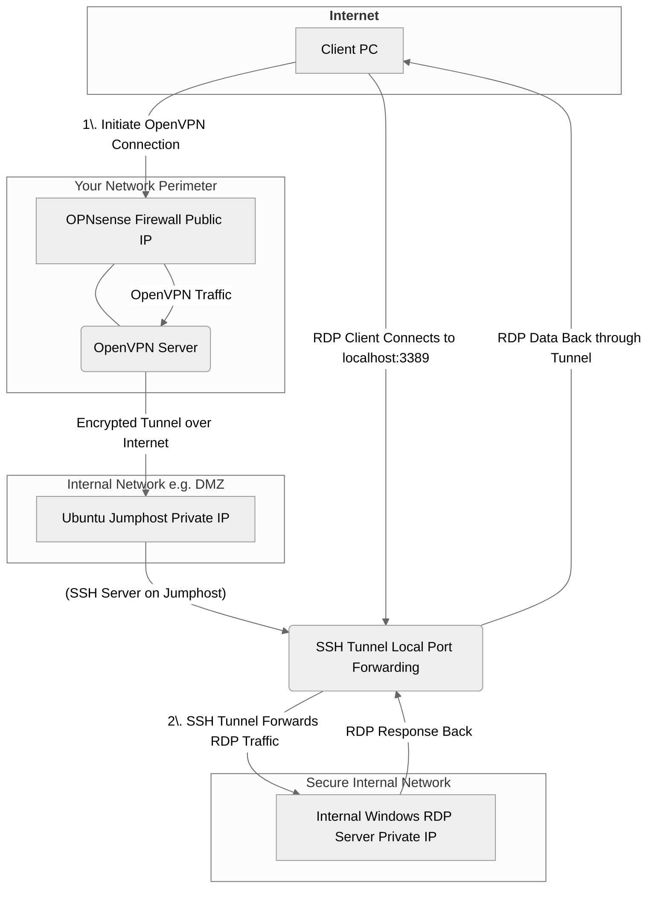
<style>
  #mermaid-network-diagram-12 {
    background-color: #f0f0f0;
  }
</style>

#### Flowchart - Network Diagram - Theme "forest"

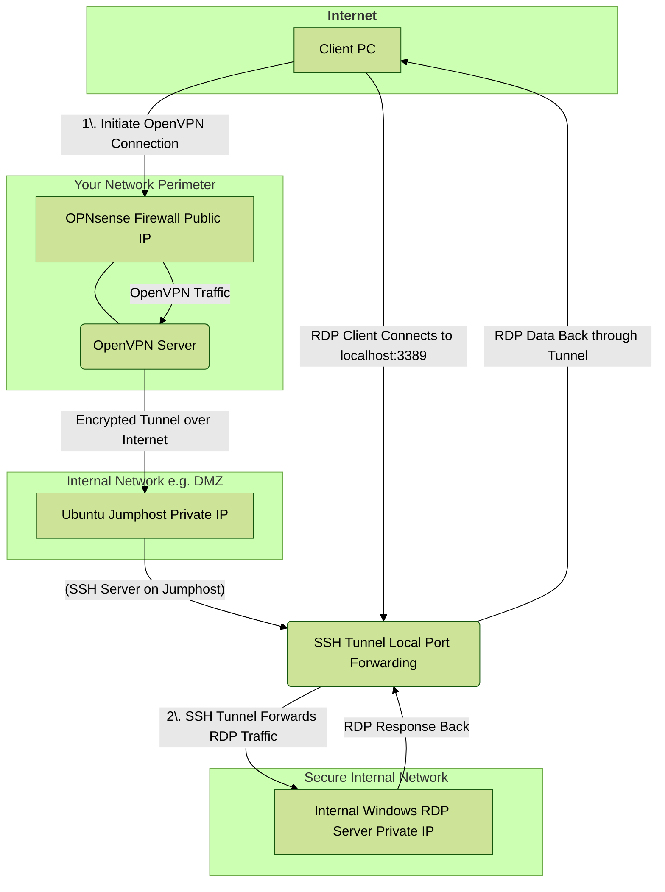
<style>
  #mermaid-network-diagram-10 {
    background-color: #f0f0f0;
  }
</style>

#### Journey

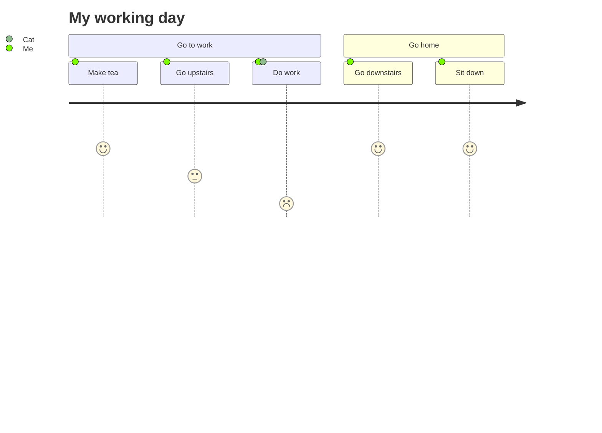

#### GANTT Diagram

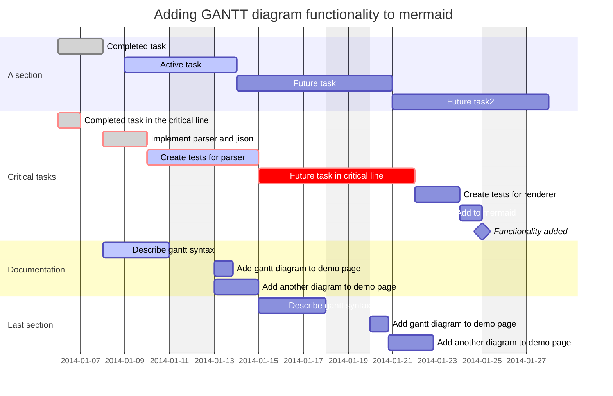
<style>
  #mermaid-gantt-10 .done0 {
      fill: #060 !important;
  }
  #mermaid-gantt-10 .doneCrit1 {
      fill: #660 !important;
  }
</style>

#### GANTT Diagram with Theme "default"


<style>
  #mermaid-gantt-12 {
    background-color: #f3f3f3;
  }
</style>

#### GANTT Diagram with Theme "forest"

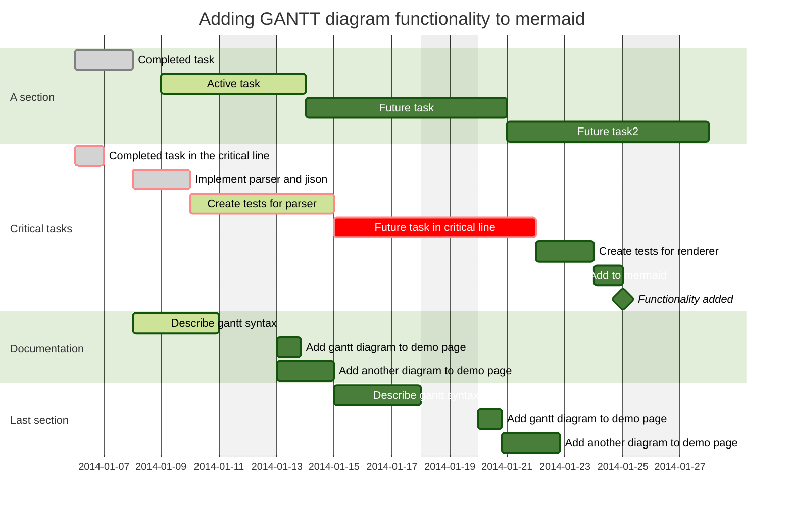
<style>
  #mermaid-gantt-11 {
    background-color: #f3f3f3;
  }
</style>

#### Sequence Diagram

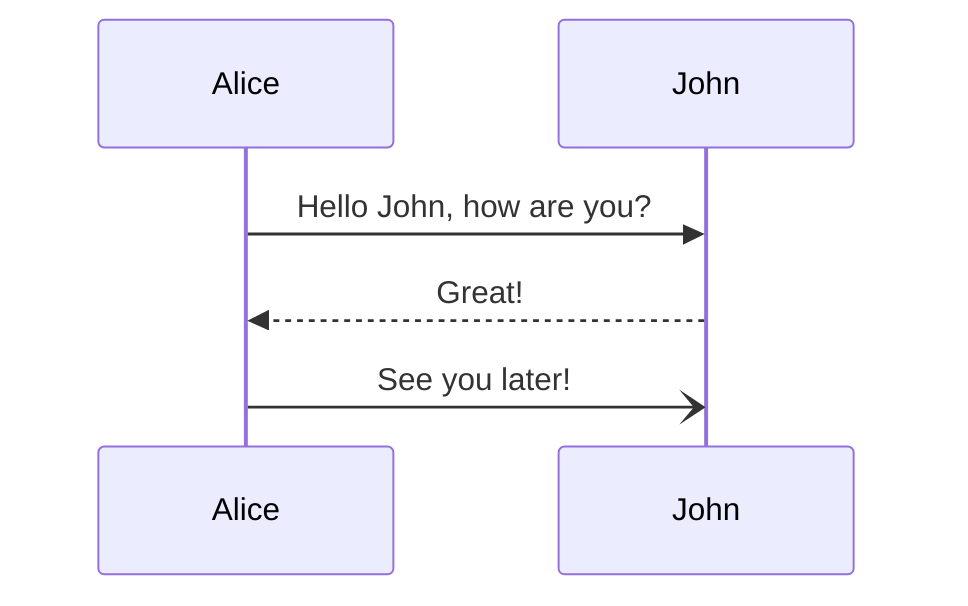

#### Class Diagram

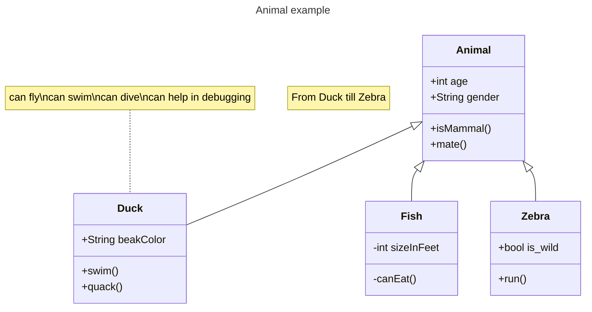

#### State Diagram

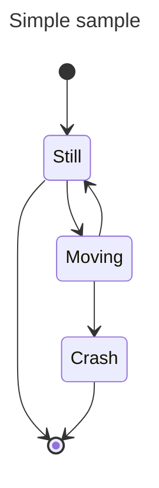

#### Entity Relationship Diagram

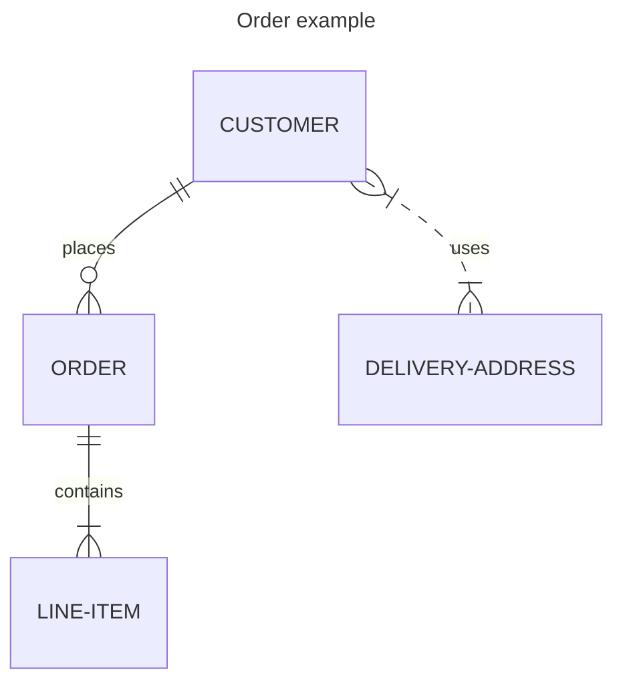

#### Pie Chart

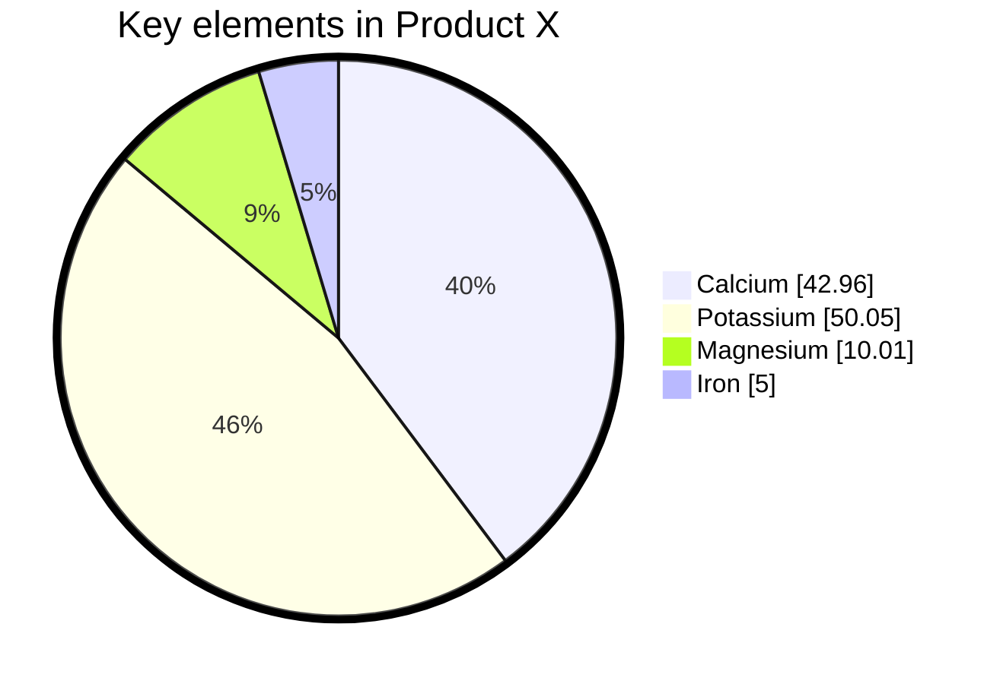

#### Quadrant Chart


#### Requirement Diagram

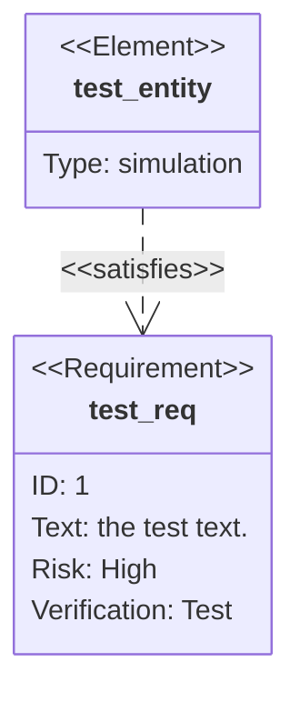

#### GitGraph Diagram

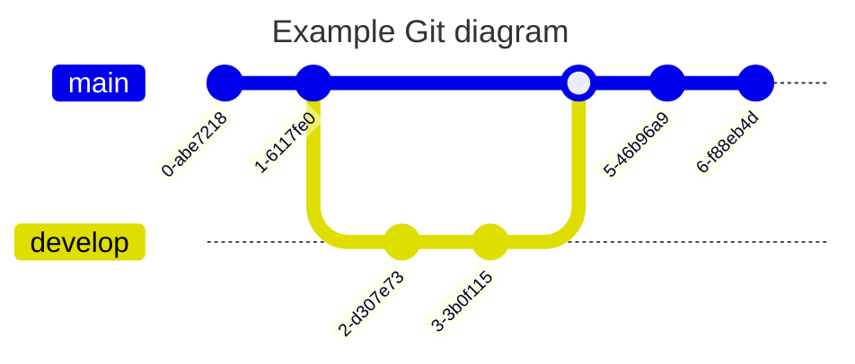

#### Timeline Diagram

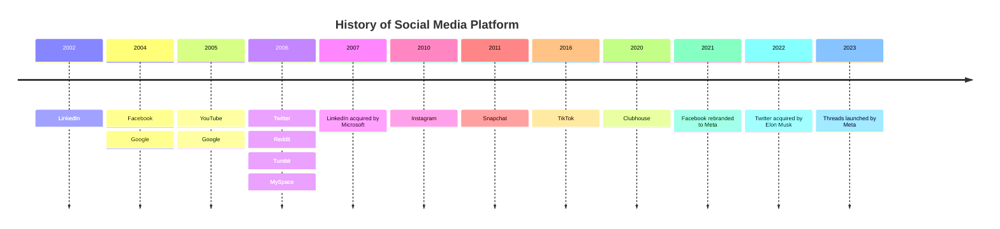

#### Timeline Diagram with rapping of text

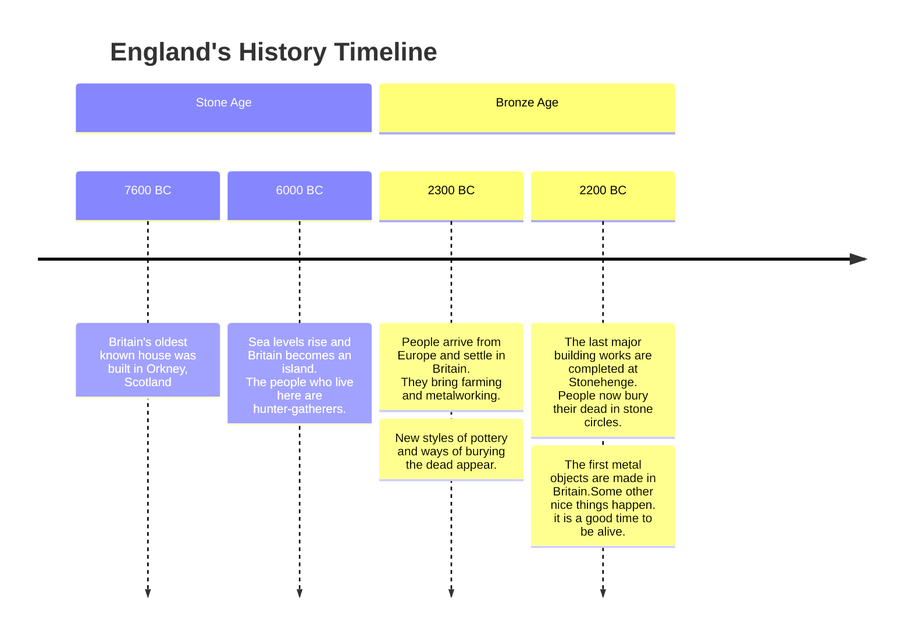

:::

:::details Task lists
- [ ] Mercury
- [x] Venus
- [x] Earth (Orbit/Moon)
- [x] Mars
- [ ] Jupiter
- [ ] Saturn
- [ ] Uranus
- [ ] Neptune
- [ ] Comet Haley
```markdown
- [ ] Mercury
- [x] Venus
- [x] Earth (Orbit/Moon)
- [x] Mars
- [ ] Jupiter
- [ ] Saturn
- [ ] Uranus
- [ ] Neptune
- [ ] Comet Haley
```
:::

:::details Footnotes
Here is a footnote reference,[^1] and another.[^longnote]

[^1]: Here is the footnote.
[^longnote]: Here's one with multiple lines  
  [HTML](https://en.wikipedia.org/wiki/HTML) Hyper Text Markup Language  
  [W3C](https://www.w3.org/)  World Wide Web Consortium
```markdown
Here is a footnote reference,[^1] and another.[^longnote]

[^1]: Here is the footnote.
[^longnote]: Here's one with multiple lines  
  [HTML](https://en.wikipedia.org/wiki/HTML) Hyper Text Markup Language  
  [W3C](https://www.w3.org/)  World Wide Web Consortium
```
:::

:::details Attributes
Place any HTML-attribute after a block {.text-center}

Here is another focusable block {.text-right #attributes-sample-id tabindex="0"}
```markdown
Place any HTML-attribute after a block {.text-center}

Here is another focusable block {.text-right #attributes-sample-id tabindex="0"}
```
:::

### Custom containers

#### Info Container
::: info 📘 This is an info title
🗲 FYI - so that you know ...  
Here is a [link for you][def]
:::

```markdown
::: info 📘 This is an info title
🗲 FYI - so that you know ...  
Here is a [link for you][def]
:::
```

#### Tip Container
::: tip 📗 This is a tip title
FYI - so that you know ...  
Here is a [link for you][def]
:::

```markdown
::: tip 📗 This is a tip title
FYI - so that you know ...  
Here is a [link for you][def]
:::
```

#### Warning Container
::: warning ⚠️ This is a warning title
**Here be dragons 🦎**  
Here is a [link for you][def]
:::

```markdown
::: warning ⚠️ This is a warning title
**Here be dragons 🦎**  
Here is a [link for you][def]
:::
```
#### Danger Container
::: danger ❗️ This is a danger title
**Attention! you are going to die ...**  
... just kidding! 😉

Here is a [link for you][def]
:::

```markdown
::: danger ❗️ This is a danger title
**Attention! you are going to die ...**  
... just kidding! 😉

Here is a [link for you][def]
:::
```

#### Line Container
::: line 💬 This is a line title
FYI - so that you know ...  
Here is a [link for you][def]
:::

```markdown
::: line 💬 This is a line title
FYI - so that you know ...  
Here is a [link for you][def]
:::
```

#### Details Container
::: details Click on this summary to see the details
Here are some **funny** details.
- Detail 1
- Detail 2
- Detail 3
:::

```markdown
::: details Click on this summary to see the details
Here are some **funny** details.
- Detail 1
- Detail 2
- Detail 3
:::
```

#### Filetree Container
::: details filetree container example with unicode characters & emojis
```filetree
 🖿 /etc/apache2/  
  ┊
  ├🗁 sites-available
  │ ├🗏 subdomain-one.domain.tld.conf
  │ └🗏 subdomain-two.domain.tld.conf    
  ┊
  ┊
 🖿 /var/www/  
  ┊
  ├🗁 subdomain-one.domain.tld
  │ ├🗁 data  
  │ │ ├🗁 database  
  │ │ ├🗁 extensions  
  │ │ └🟢 uploads  
  │ └🗏 docker-compose.yml  
  ┊
  ├🗁 subdomain-two.domain.tld  
  │ ├🗁 data  
  │ │ ├🗁 database  
  │ │ ├🗁 extensions  
  │ │ └🟢 uploads  
  ┊ └🗏 docker-compose.yml 

╭────────═━┈☀️┈━═────────╮
│   🟢 image uploads.    │
╰────────═━┈🌙┈━═────────╯
```
:::

## Syntax Highlighting

EasyDoc uses [Prism](https://prismjs.com/) to highlight syntax in code blocks.

#### Supported languages

+ ✅ [Markup (HTML,XML etc.)](#cbe-html){.openIdInClosedDetails}
+ ✅ [CSS, CSS Extras](#cbe-css){.openIdInClosedDetails}
+ ✅ [JavaScript](#cbe-js){.openIdInClosedDetails}
+ ✅ [Apache Configuration](#cbe-apacheconf){.openIdInClosedDetails}
+ ✅ [Bash + Shell](#cbe-shell){.openIdInClosedDetails}
+ ✅ [Batch](#cbe-batch){.openIdInClosedDetails}
+ ✅ [C-like](#cbe-clike){.openIdInClosedDetails}
+ ✅ [Diff](#cbe-diff){.openIdInClosedDetails}
+ ✅ [Docker](#cbe-dockerfile){.openIdInClosedDetails}
+ ✅ [EditorConfig](#cbe-editorconfig){.openIdInClosedDetails}
+ ✅ [Git](#cbe-git){.openIdInClosedDetails}
+ ✅ [GraphQL](#cbe-graphql){.openIdInClosedDetails}
+ ✅ [Ini](#cbe-ini){.openIdInClosedDetails}
+ ✅ [JSON, Web App Mainfest](#cbe-json){.openIdInClosedDetails}
+ ✅ [Less](#cbe-less){.openIdInClosedDetails}
+ ✅ [Markdown](#cbe-markdown){.openIdInClosedDetails}
+ ✅ [MongoDB](#cbe-mongodb){.openIdInClosedDetails}
+ ✅ [Nginx](#cbe-nginx){.openIdInClosedDetails}
+ ✅ [PHP](#cbe-php){.openIdInClosedDetails}
+ ✅ [PHPDoc](#cbe-html){.openIdInClosedDetails}
+ ✅ [PowerShell](#cbe-powershell){.openIdInClosedDetails}
+ ✅ [Pug](#cbe-pug){.openIdInClosedDetails}
+ ✅ [Python](#cbe-python){.openIdInClosedDetails}
+ ✅ [Sass (scss)](#cbe-scss){.openIdInClosedDetails}
+ ✅ [SQL](#cbe-sql){.openIdInClosedDetails}
+ ✅ [TypeScript](#cbe-ts){.openIdInClosedDetails}
+ ✅ [YAML](#cbe-yml){.openIdInClosedDetails}

{style="column-width:25ch;column-gap:1em;list-style-type:none;padding-left:0;"}

#### Plugins

+ ✅ [Line Numbers](#t-line-numbers)
+ ✅ [Line Highlight](#t-line-highlight--linkable-line-numbers)
+ ✅ [Commad Line](#t-commad-line)
+ ✅ [Show Language](#t-show-language)
+ ✅ [Toolbar](#t-toolbar)
+ ✅ [Copy to Clipboard Button](#t-copy-to-clipboard-button)

{style="column-width:25ch;column-gap:1em;list-style-type:none;padding-left:0;"}

To get your own configuration go to: 
[prismjs](https://prismjs.com/download.html)

---

### Prism Plugins

##### Line Numbers

::: details Line Numbers Example
```js {.line-numbers data-start="1000"}
(function () {
  "use strict";
  document.addEventListener("DOMContentLoaded", function () {
    const state = {
      global: {
        lastActiveElement: Element | null,
        currentInputIsMouse: false,
        filename: window.location.pathname.substring(window.location.pathname.lastIndexOf('/') + 1),
      },
      nav: {
        isOpen: false,
        ps: pubsub(),
        ignoreClickOutsideClass: ["ignore_click_outside"],
      },
      meta: typeof easydocMeta !== "undefined" ? easydocMeta : false,
      selectedTags: [],
      tagCloud: {
        sort: "name",
        order: "asc",
        tags: [],
      },
      pageCards: [],
    };
    const elMenuToggle = document.querySelector(".burger");
    const elMain = document.querySelector("main");
    const elNavigationDrawer = document.querySelector(".navigation-drawer");
    const elContainer = document.querySelector(".content");
    const toggleBurger = burger();
    // ...
  });
})();
```
Specify the data-start (Number) attribute for line numbers.  
The above example uses ```.line-numbers``` class and ```data-start="1000"```.

```markdown
```js {.line-numbers data-start="1000"}
```
:::

Refer to the manual at [Prism Plugins - Line Numbers](https://prismjs.com/plugins/line-numbers/)

##### Line Highlight & Linkable Line Numbers

::: details Line Highlight Example
```js {.line-numbers data-line="8,24-25"}
(function () {
  "use strict";
  document.addEventListener("DOMContentLoaded", function () {
    const state = {
      global: {
        lastActiveElement: Element | null,
        currentInputIsMouse: false,
        filename: window.location.pathname.substring(window.location.pathname.lastIndexOf('/') + 1),
      },
      nav: {
        isOpen: false,
        ps: pubsub(),
        ignoreClickOutsideClass: ["ignore_click_outside"],
      },
      meta: typeof easydocMeta !== "undefined" ? easydocMeta : false,
      selectedTags: [],
      tagCloud: {
        sort: "name",
        order: "asc",
        tags: [],
      },
      pageCards: [],
    };
    const elMenuToggle = document.querySelector(".burger");
    const elMain = document.querySelector("main");
    const elNavigationDrawer = document.querySelector(".navigation-drawer");
    const elContainer = document.querySelector(".content");
    const toggleBurger = burger();
    // ...
  });
})();
```
Specify the data-line attribute to highlight lines.  
The above example uses ```data-line="8,24-25"```.

```markdown
```js {.line-numbers data-line="8,24-25"}
```
:::

::: details Linkable Line Numbers
```js {.line-numbers .linkable-line-numbers}
(function () {
  "use strict";
  document.addEventListener("DOMContentLoaded", function () {
    const state = {
      global: {
        lastActiveElement: Element | null,
        currentInputIsMouse: false,
        filename: window.location.pathname.substring(window.location.pathname.lastIndexOf('/') + 1),
      },
      nav: {
        isOpen: false,
        ps: pubsub(),
        ignoreClickOutsideClass: ["ignore_click_outside"],
      },
      meta: typeof easydocMeta !== "undefined" ? easydocMeta : false,
      selectedTags: [],
      tagCloud: {
        sort: "name",
        order: "asc",
        tags: [],
      },
      pageCards: [],
    };
    const elMenuToggle = document.querySelector(".burger");
    const elMain = document.querySelector("main");
    const elNavigationDrawer = document.querySelector(".navigation-drawer");
    const elContainer = document.querySelector(".content");
    const toggleBurger = burger();
    // ...
  });
})();
```
Add class ```.linkable-line-numbers``` to make lines selectable.

```markdown
```js {.line-numbers .linkable-line-numbers}
```

⚠️ You may **not** want to use ```.linkable-line-numbers``` together with ```data-line``` attribute, as the linked line marker will overwrite the highlighted marker, when the line is clicked. {.custom-conatiner .warning style="padding:1em;"}

---
:::

Refer to the manual at [Prism Plugins - Line Highlight](https://prismjs.com/plugins/line-highlight/)

##### Commad Line

::: details Command Line Example
```sh {.command-line data-user="root" data-host="someserver.tld" data-output="4"}
apt-get update
apt-get upgrade
apt-get --assume-yes install curl vim mc htop imagemagick git nodejs npm
... some output from last command
```
Add class ```.command-line``` to code block.  
You may specify ```data-user```and ```data-host``` as well as the lines for the output with the ```data-output``` attribute.

```markdown
```sh {.command-line data-user="root" data-host="someserver.tld" data-output="4"}
```
:::

Refer to the manual at [Prism Plugins - Commad Line](https://prismjs.com/plugins/command-line/)

##### Show Language

Refer to the manual at [Prism Plugins - Show Language](https://prismjs.com/plugins/show-language/)

##### Toolbar

Refer to the manual at [Prism Plugins - Toolbar](https://prismjs.com/plugins/toolbar/)

##### Copy to Clipboard Button

Refer to the manual at [Prism Plugins - Copy to Clipboard Button](https://prismjs.com/plugins/copy-to-clipboard)

---

### Syntax Highlighting Examples

You can also look up [Examples at Prism](https://prismjs.com/examples.html)

::: details HTML {.closeOnLoad data-open="true"}
```html  {.line-numbers .linkable-line-numbers #cbe-html}
<!DOCTYPE html>
<html lang="en">
  <head>
	<meta charset="utf-8" />
  <meta name="viewport" content="width=device-width, initial-scale=1.0">
	<title>My Title</title>
	<style>
    @media print {
      p { color: red !important; }
		}
	</style>
</head>
<body>
	<h1>My Heading</h1>
	<script>
    if (document) {
      console.log('foo');
	}
	</script>
</body>
</html>
```
:::

::: details CSS {.closeOnLoad data-open="true"}
```css  {.line-numbers .linkable-line-numbers #cbe-css}
body, html {
  padding: 0;
  margin: 0;
  background-color: #000;
}

*, *:before, *:after {
  box-sizing: border-box;
}

a, article, aside, blockquote, body, code, dd, div, dl, dt, fieldset,
figcaption, figure, footer, form, h1, h2, h3, h4, h5, h6, header, legend, li,
main, nav, ol, p, pre, section, table, td, textarea, th, tr, ul {
  box-sizing: border-box;
}

hr {
  border-top-color: hsla(0,0%,100%,.1)
}

table {
  border-collapse: collapse;
}

tr:nth-child(2n) {
  background-color: rgb(32, 34, 35);
}

@media (min-width: 480px) {
  .content {
    padding: 2rem 2.5rem 1rem;
  }
  .mtime {
    padding: 0.7rem 2.5rem 0;
  }
}
```
:::

::: details JavaScript {.closeOnLoad data-open="true"}
```js  {.line-numbers .linkable-line-numbers #cbe-js}
"use strict";

const path = require("path");
const fs = require("fs");
const pug = require("pug");
const fm = require("front-matter");

const md = require("markdown-it")({
  html: true,
  linkify: true,
  typographer: true,
});
md.use(require("markdown-it-deflist"));
md.use(require("markdown-it-container"), "tip");

const docsDir = path.join(__dirname, "docs");
const templateDir = path.join(__dirname, "templates");
const layout = path.join(templateDir, "layout.pug");
const distDir = path.join(__dirname, "www");
const rgxExt = /\.(?:md)$/;
const outExt = ".html";

// iterate over files
fs.readdir(docsDir, (err, files) => {
  if (err) {
    return console.log("Unable to scan directory: " + err);
  }
  files.forEach((file) => {
    let fmData = fm(fs.readFileSync(path.join(docsDir, file), "utf-8"));
    let stats = fs.statSync(path.join(docsDir, file));
    const page = pug.renderFile(layout, {
      content: md.render(fmData.body),
      attributes: {
        title: fmData.attributes.title
          ? fmData.attributes.title
          : "Documentation",
        lang: fmData.attributes.lang ? fmData.attributes.lang : "en",
        mtime: stats.mtime,
      },
    });
    fs.writeFileSync(path.join(distDir, file.replace(rgxExt, outExt)), page);
  });
});
```
:::

::: details Apache Configuration {.closeOnLoad data-open="true"}
```apacheconf {.line-numbers .linkable-line-numbers #cbe-apacheconf}
<VirtualHost *:80>
    ServerAdmin webmaster@localhost
    ServerName subdomain.domain.tld
    Redirect permanent / https://subdomain.domain.tld/
    ErrorLog ${APACHE_LOG_DIR}/subdomain.domain.tld.error.log
    CustomLog ${APACHE_LOG_DIR}/subdomain.domain.tld.access.log combined
</VirtualHost>
<IfModule mod_ssl.c>
    <VirtualHost *:443>
        ServerAdmin webmaster@localhost
        ServerName subdomain.domain.tld
        DocumentRoot /var/www/html

        SSLEngine on
        SSLProtocol All -SSLv2 -SSLv3 -TLSv1 -TLSv1.1
        SSLCipherSuite ECDHE-ECDSA-AES128-GCM-SHA256:ECDHE-ECDSA-AES256-GCM-SHA384:ECDHE-ECDSA-AES128-SHA:ECDHE-ECDSA-AES256-SHA:ECDHE-ECDSA-AES128-SHA256:ECDHE-ECDSA-AES256-SHA384:ECDHE-RSA-AES128-GCM-SHA256:ECDHE-RSA-AES256-GCM-SHA384:ECDHE-RSA-AES128-SHA:ECDHE-RSA-AES256-SHA:ECDHE-RSA-AES128-SHA256:ECDHE-RSA-AES256-SHA384:DHE-RSA-AES128-GCM-SHA256:DHE-RSA-AES256-GCM-SHA384:DHE-RSA-AES128-SHA:DHE-RSA-AES256-SHA:DHE-RSA-AES128-SHA256:DHE-RSA-AES256-SHA256
        SSLHonorCipherOrder on
        SSLOptions +StrictRequire
        SSLCertificateKeyFile /etc/letsencrypt/live/subdomain.domain.tld/privkey.pem
        SSLCertificateFile  /etc/letsencrypt/live/subdomain.domain.tld/fullchain.pem

        Header always set Strict-Transport-Security "max-age=31536000; includeSubDomains; preload"
        Header set Access-Control-Allow-Origin "*"
        Protocols h2 http/1.1

        ProxyPass /.well-known/acme-challenge !

        ProxyPass /phpmyadmin/  http://localhost:8080/
        ProxyPassReverse /phpmyadmin/ http://localhost:8080/

        ProxyPass /  http://localhost:8055/
        ProxyPassReverse / http://localhost:8055/

        ErrorLog ${APACHE_LOG_DIR}/subdomain.domain.tld.error.log
        CustomLog ${APACHE_LOG_DIR}/subdomain.domain.tld.access.log combined

        <FilesMatch "\.(phtml|php)$">
            SSLOptions +StdEnvVars
        </FilesMatch>

    </VirtualHost>
</IfModule>
```
:::

::: details Bash / Shell {.closeOnLoad data-open="true"}
```shell  {.line-numbers .linkable-line-numbers #cbe-shell}
apt get update
apt get upgrade
cd /etc/apache2/sites-available
ls -la
vim ./000-default-ssl.conf
```
:::

::: details Batch {.closeOnLoad data-open="true"}
```batch  {.line-numbers .linkable-line-numbers #cbe-batch}
@ECHO OFF
IF NOT "%~1"=="" GOTO Syntax
 
:: Check for WinPE first, as WMI might not be available in WinPE
REG.EXE Query HKLM\SYSTEM\ControlSet001\Control\MiniNT >NUL 2>&1
IF NOT ERRORLEVEL 1 (
	ECHO Windows PE
	EXIT /B 3
)
 
:: Check for "regular" boot state
WMIC.EXE Path Win32_ComputerSystem Get BootupState | FIND.EXE "Normal boot" >NUL
IF NOT ERRORLEVEL 1 (
	ECHO Normal
	EXIT /B 0
)
 
WMIC.EXE Path Win32_ComputerSystem Get BootupState | FIND.EXE "Fail-safe boot" >NUL
IF NOT ERRORLEVEL 1 (
	ECHO Safe mode
	EXIT /B 1
)
 
WMIC.EXE Path Win32_ComputerSystem Get BootupState | FIND.EXE "Fail-safe with network boot" >NUL
IF NOT ERRORLEVEL 1 (
	ECHO Safe mode with network
	EXIT /B 2
)
 
ECHO Unknown
EXIT /B -1
 
 
:Syntax
ECHO.
ECHO BootState.bat,  Version 1.04
ECHO Show Windows' boot state
ECHO.
ECHO Usage:    BootState.bat
ECHO.
ECHO Notes:    Boot state is returned as string and as "errorlevel" ^(return code^):
ECHO               "Normal"                    ^(errorlevel = 0^)
ECHO               "Safe mode"                 ^(errorlevel = 1^)
ECHO               "Safe mode with network"    ^(errorlevel = 2^)
ECHO               "Windows PE"                ^(errorlevel = 3^)
ECHO           In case of ^(command line^) errors, the errorlevel will be -1.
EXIT /B -1
```
:::

::: details C-like {.closeOnLoad data-open="true"}
```clike  {.line-numbers .linkable-line-numbers #cbe-clike}
int factorialSafe(int n) {
    int result = 1;
    if(n<0)
        return -1;
    for (int i = 1; i <= n; ++i)
        result *= i;
    return result;
}
```
:::

::: details Diff {.closeOnLoad data-open="true"}
```diff  {.line-numbers .linkable-line-numbers #cbe-diff}
diff --git a/docs/www/css/style.css b/docs/www/css/style.css
index a0b00ff..d4a3c3e 100644
--- a/docs/www/css/style.css
+++ b/docs/www/css/style.css
@@ -15,12 +15,36 @@ body {
     box-sizing: border-box;
 }
 
-a, article, aside, blockquote, body, code, dd, div, dl, dt, fieldset, figcaption, figure, footer, form, h1, h2, h3, h4, h5, h6, header, legend, li, main, nav, ol, p, pre, section, table, td, textarea, th, tr, ul {
+a, article, aside, blockquote, body, code, dd, div, dl, dt, fieldset,
+figcaption, figure, footer, form, h1, h2, h3, h4, h5, h6, header, legend, li,
+main, nav, ol, p, pre, section, table, td, textarea, th, tr, ul {
     box-sizing: border-box;
 }
 
 hr {
-    border-top-color: hsla(0,0%,100%,.1)
+    border: none;
+    border-top: 1px solid #666;
+}
+
+table {
+    border-collapse: collapse;
+}
+
+tr:nth-child(2n) {
+    background-color: rgb(32, 34, 35);
+}
+
+tr:hover {
+    background-color: rgb(44, 47, 48);
+}
+
+th, td {
+    text-align: left;
+    border: 1px solid rgb(59, 62, 64);
+    padding: 0.5rem;
+}
+th {
+    background-color: #24292d;
 }
 
 dt {
@@ -35,9 +59,11 @@ a code {
     color: #2196f3;
 }
 
+
+/* layout */
+
 .page {
     display: block;
-    /* padding-bottom: 2rem; */
 }
 .mtime {
     max-width: 1200px;
@@ -70,9 +96,13 @@ a code {
 }
 
 .content img {
-    max-width: 100%
+    max-width: 100%;
+    border-radius: 6px;
 }
 
+
+/* code blocks */
+
 .content pre[class*=language-] {
     border-radius: 6px;
     padding-top: 2.5rem;
```
:::

::: details Docker {.closeOnLoad data-open="true"}
```dockerfile  {.line-numbers .linkable-line-numbers #cbe-dockerfile}
FROM ubuntu:20.04

ENV APACHE_RUN_USER     www-data
ENV APACHE_RUN_GROUP    www-data
ENV APACHE_LOG_DIR      /var/log/apache2
ENV APACHE_PID_FILE     /var/run/apache2.pid
ENV APACHE_RUN_DIR      /var/run/apache2
ENV APACHE_LOCK_DIR     /var/lock/apache2
ENV APACHE_LOG_DIR      /var/log/apache2

ENV CA_PROVIDENCE_VERSION=1.7.13
ENV CA_PROVIDENCE_DIR=/var/www/providence
ENV CA_PAWTUCKET_VERSION=1.7.13
ENV CA_PAWTUCKET_DIR=/var/www

ENV DEBIAN_FRONTEND=noninteractive

RUN apt-get update && apt-get install -y apache2 \
	curl \
	wget \
	zip \
	php7.4 \
	php7.4-curl \
	php7.4-gd \
	php7.4-xml \
	php7.4-zip \
	php-mysql \
	php-ldap \
	libapache2-mod-php7.4 \
	mysql-client \
	ffmpeg \
	ghostscript \
	imagemagick \
	libreoffice

#GMAGICK
RUN apt-get install -y php-pear php7.4-dev graphicsmagick libgraphicsmagick1-dev \
	&& pecl install gmagick-2.0.4RC1

# https://github.com/collectiveaccess/providence/archive/refs/tags/$CA_PROVIDENCE_VERSION.gz
RUN curl -SsL https://github.com/collectiveaccess/providence/archive/refs/tags/$CA_PROVIDENCE_VERSION.tar.gz | tar -C /var/www/ -xzf -
RUN mv /var/www/providence-$CA_PROVIDENCE_VERSION /var/www/providence
RUN cd $CA_PROVIDENCE_DIR && cp setup.php-dist setup.php

RUN curl -SsL https://github.com/collectiveaccess/pawtucket2/archive/refs/tags/$CA_PAWTUCKET_VERSION.tar.gz | tar -C /var/www/ -xzf -
RUN mv $CA_PAWTUCKET_DIR/pawtucket2-$CA_PAWTUCKET_VERSION/* /var/www
RUN cd $CA_PAWTUCKET_DIR && cp setup.php-dist setup.php

RUN sed -i "s@DocumentRoot \/var\/www\/html@DocumentRoot \/var\/www@g" /etc/apache2/sites-available/000-default.conf
RUN rm -rf /var/www/html
RUN ln -s /$CA_PROVIDENCE_DIR/media /$CA_PAWTUCKET_DIR/media

RUN chown -R www-data:www-data /var/www

# Create a backup of the default conf files in case directory is mounted
RUN mkdir -p /var/ca/providence/conf
RUN cp -r /$CA_PROVIDENCE_DIR/app/conf/* /var/ca/providence/conf

# Copy our local files
COPY php.ini /etc/php/7.4/apache2/php.ini
COPY entrypoint.sh /entrypoint.sh
RUN chmod 777 /entrypoint.sh

# Run apcache from entrypoint.sh
ENTRYPOINT ["/entrypoint.sh"]
CMD [ "/usr/sbin/apache2", "-DFOREGROUND" ]
```
:::

::: details EditorConfig {.closeOnLoad data-open="true"}
```editorconfig  {.line-numbers .linkable-line-numbers #cbe-editorconfig}
# EditorConfig is awesome: https://EditorConfig.org

# top-most EditorConfig file
root = true

# Unix-style newlines with a newline ending every file
[*]
end_of_line = lf
insert_final_newline = true

# Matches multiple files with brace expansion notation
# Set default charset
[*.{js,py}]
charset = utf-8

# 4 space indentation
[*.py]
indent_style = space
indent_size = 4

# Tab indentation (no size specified)
[Makefile]
indent_style = tab

# Indentation override for all JS under lib directory
[lib/**.js]
indent_style = space
indent_size = 2

# Matches the exact files either package.json or .travis.yml
[{package.json,.travis.yml}]
indent_style = space
indent_size = 2
```
:::

::: details Git {.closeOnLoad data-open="true"}
```git  {.line-numbers .linkable-line-numbers #cbe-git}
$ git diff
diff --git file.txt file.txt
index 6214953..1d54a52 100644
--- file.txt
+++ file.txt
@@ -1 +1,2 @@
-Here's my tetx file
+Here's my text file
+And this is the second line
```
:::

::: details GrapQL {.closeOnLoad data-open="true"}
```graphql  {.line-numbers .linkable-line-numbers #cbe-graphql}
query withFragments {
  user(id: 4) {
    friends(first: 10) {
      ...friendFields
    }
    mutualFriends(first: 10) {
      ...friendFields
    }
  }
}

fragment friendFields on User {
  id
  name
  profilePic(size: 50)
}
```
:::

::: details INI {.closeOnLoad data-open="true"}
```ini  {.line-numbers .linkable-line-numbers #cbe-ini}
# Automatically generated for Debian scripts. DO NOT TOUCH!
[client]
host     = localhost
user     = root
password = <YOUR MYSQL ROOT PASSWORD>
socket   = /var/run/mysqld/mysqld.sock
[mysql_upgrade]
host     = localhost
user     = root
password = <YOUR MYSQL ROOT PASSWORD>
socket   = /var/run/mysqld/mysqld.sock
basedir  = /usr
```
:::

::: details JSON {.closeOnLoad data-open="true"}
```json  {.line-numbers .linkable-line-numbers #cbe-json}
{
  "firstName": "John",
  "lastName": "Smith",
  "age": 25,
  "categories": [
    {
      "id": 19,
      "category": "Venue",
      "comment": null,
      "pivot": {
        "address_id": 6213,
        "category_id": 19,
        "updated_by": 34,
        "created_by": 34,
        "created_at": "2004-03-10T15:18:27.000000Z",
        "updated_at": "2004-03-10T15:18:27.000000Z"
      }
    }
  ],
}
```
:::

::: details Less {.closeOnLoad data-open="true"}
```less  {.line-numbers .linkable-line-numbers #cbe-less}
.foo (@bg: #f5f5f5, @color: #900) {
  background: @bg;
  color: @color;
}
.bar {
  .foo();
}
.class1 {
  .mixin(@margin: 20px; @color: #33acfe);
}
.class2 {
  .mixin(#efca44; @padding: 40px);
}
@mySelector: banner;
.@{mySelector} {
  font-weight: bold;
}
@property: color;
.widget {
  @{property}: #0ee;
  background-@{property}: #999;
}
```
:::

::: details Markdown {.closeOnLoad data-open="true"}
```markdown  {.line-numbers .linkable-line-numbers #cbe-markdown}
Title 1
==

Title 2
-------

# Title 1 {.text-center}
## Title 2
### Title 3
#### Title 4
##### Title 5
###### Title 6

- listitem 1
- listitem 2
- listitem 3

```
:::

::: details MongoDB {.closeOnLoad data-open="true"}
```mongodb  {.line-numbers .linkable-line-numbers #cbe-mongodb}
{
	'_id': ObjectId('5ec72ffe00316be87cab3927'),
	'code': Code('function () { return 22; }'),
	'binary': BinData(1, '232sa3d323sd232a32sda3s2d3a2s1d23s21d3sa'),
	'dbref': DBRef('namespace', ObjectId('5ec72f4200316be87cab3926'), 'db'),
	'timestamp': Timestamp(0, 0),
	'long': NumberLong(9223372036854775807),
	'decimal': NumberDecimal('1000.55'),
	'integer': 100,
	'maxkey': MaxKey(),
	'minkey': MinKey(),
	'isodate': ISODate('2012-01-01T00:00:00.000Z'),
	'regexp': RegExp('prism(js)?', 'i'),
	'string': 'Hello World',
	'numberArray': [1, 2, 3],
	'stringArray': ['1','2','3'],
	'randomKey': null,
	'object': { 'a': 1, 'b': 2 },
	'max_key2': MaxKey(),
	'number': 1234,
	'invalid-key': 123,
	noQuotesKey: 'value',
}
db.users.find({
	_id: { $nin: ObjectId('5ec72ffe00316be87cab3927') },
	age: { $gte: 18, $lte: 99 },
	field: { $exists: true }
})
```
:::

::: details Nginx {.closeOnLoad data-open="true"}
```nginx  {.line-numbers .linkable-line-numbers #cbe-nginx}
server { # simple reverse-proxy
  listen       80;
  server_name  domain2.com www.domain2.com;
  access_log   logs/domain2.access.log  main;
  
  # serve static files
  
  location ~ ^/(images|javascript|js|css|flash|media|static)/  {
    root    /var/www/virtual/big.server.com/htdocs;
    expires 30d;
  }

  # pass requests for dynamic content to rails/turbogears/zope, et al
  location / {
    proxy_pass      http://127.0.0.1:8080;
  }
}
```
:::

::: details PHP {.closeOnLoad data-open="true"}
```php  {.line-numbers .linkable-line-numbers #cbe-php}
declare(strict_types=1);
/*
 * This file is part of the Gws package.
 *
 * For the full copyright and license information, please view the LICENSE
 * file that was distributed with this source code.
 */

namespace Gws\Image;

use Gws\System\Msg;

/**
 * Image Compressor
 *
 * @author Viktor Grandgeorg <viktor@grandgeorg.de>
 */
class Compressor
{
    use Msg;

    protected $sysconf;
    protected $logger;
    protected $conf;
    protected $cFormat;
    protected $mandatories = [
        'input_dir',
        'output_dir',
        'resize',
        'jpeg_recompress'
    ];
    protected $ext = array('jpg', 'jpeg');

    public function __construct($sysconf, $logger, $conf)
    {
        $this->sysconf = $sysconf;
        $this->logger = $logger;
        $this->conf = $conf;
    }

    public function run(): int
    {
        foreach ($this->conf->get('formats') as $format) {
            if ($this->validateFormat($format) &&
                $this->validateDir($format['input_dir']) &&
                $this->validateDir($format['output_dir'], true))
            {
                $this->cFormat = array_merge(
                    $this->defaults,
                    $format,
                    [
                        'input_dir_realpath' => realpath($format['input_dir']),
                        'output_dir_realpath' => realpath($format['output_dir'])
                    ]
                );
                $this->filterJrcMethod();
                $this->dispatchImages();
            } else {
                return 1;        
            }
        }
        return 0;
    }

    protected function validateFormat(array $format): bool
    {
        foreach ($this->mandatories as $mandatory) {
            if (!array_key_exists($mandatory, $format)) {
                $this->msg(
                    sprintf($this->sysconf->get('msg'), $mandatory) . "\n", 
                    'all', 'debug', $format
                );
                return false;
            }
        }
        return true;
    }

    // ...
}
```
:::

::: details PHPDoc {.closeOnLoad data-open="true"}
```phpdoc  {.line-numbers .linkable-line-numbers #cbe-phpdoc}
/** @var \DateTime[] An array of DateTime objects. */
/** @var string[] An array of string objects. */
/** @var callable[] An array of with callable functions or methods. */

/** @var \ArrayObject|\DateTime[] */
$dates = array()

/**
 * @param bool|\DateTime $foo the first argument
 * @return string|null
 */
function bar($foo) { ... }
```
:::

::: details PowerShell {.closeOnLoad data-open="true"}
```powershell  {.line-numbers .linkable-line-numbers #cbe-powershell}
Function SayHello([string]$name) {
    Write-Host "Hello, $name."
}
$Names = @("Bob", "Alice")

$Names | ForEach {
    SayHello $_
}
```
:::

::: details Pug {.closeOnLoad data-open="true"}
```pug  {.line-numbers .linkable-line-numbers #cbe-pug}
doctype html
html(lang=attributes.lang)
  head
    title=attributes.title
    meta(charset="UTF-8")
    meta(name="viewport" content="width=device-width, initial-scale=1.0")
    link(rel='stylesheet' href='assets/css/style.min.css')
    link(rel="stylesheet" href="assets/css/prism.min.css")
    script(src="assets/js/clipboard.min.js")
    script(src="assets/js/prism.js")
    script(src="assets/js/raphael.min.js")
    script(src="assets/js/flowchart.min.js")
    script(src="assets/js/app.min.js")
    script(src="meta.js")
  body
    if !attributes.disableNavigationBar
      .navbar
        if !attributes.disableBrand
          a.navbar__brand(href=attributes.brandURL)
            if attributes.brandName
              span.brand #{attributes.brandName}
            if attributes.brandSecondary
              span.brand-second #{attributes.brandSecondary}
        .navbar__controls
          if !attributes.disableTagNavigator
            button.btn-tag-nav.navitem#open-tag-navigation(aria-label="open tag navigation" title="open tag navigation" role="button")
              span.navitem-title #{t.tagNav}
          if !attributes.disableBurger
            button.burger(aria-expanded="false" aria-label="navigation menu")
              span.burger__line.burger__line-1(aria-hidden="true" focusable="false")
              span.burger__line.burger__line-2(aria-hidden="true" focusable="false")
              span.burger__line.burger__line-3(aria-hidden="true" focusable="false")
      if !attributes.disableBurger
        nav.navigation-drawer(aria-label="Main menu")
          if !attributes.disableToc
            h3.nav-title.text-center #{t.toc}
            .toc !{toc}
          if !attributes.disableSiteNav
            .sitenav !{sitenav}

    main.page
      .mtime #{t.mtime} #{attributes.mtime}
      .content !{content}
      .footer
        if !attributes.disableBrand
          a(href=attributes.brandURL class="brand-link")
            if attributes.brandName
              span.brand #{attributes.brandName}
            if attributes.brandSecondary
              span.brand-second #{attributes.brandSecondary}
```
:::

::: details Python {.closeOnLoad data-open="true"}
```python  {.line-numbers .linkable-line-numbers #cbe-python}
from itertools import (accumulate, chain)
from operator import mul

# factorials :: [Integer]
def factorials(n):
    return list(
        accumulate(chain([1], range(1, 1 + n)), mul)
    )

print(factorials(5))
 
# -> [1, 1, 2, 6, 24, 120]
```
:::

::: details Sass (scss) {.closeOnLoad data-open="true"}
```scss  {.line-numbers .linkable-line-numbers #cbe-scss}
@mixin scrollbars($size, $foreground-color,  $foreground-color-hover, $background-color, $border-radius, $border-width) {

  // For Google Chrome
  &::-webkit-scrollbar {
    width: $size;
  }

  &::-webkit-scrollbar-thumb {
    background-color: $foreground-color;
    border-radius: $border-radius;
    border: $border-width solid $background-color
  }

  &::-webkit-scrollbar-thumb:hover {
    background-color: $foreground-color-hover;
  }

  &::-webkit-scrollbar-track {
    background-color: $background-color;
  }

  // For Internet Explorer
  & {
    scrollbar-face-color: $foreground-color;
    scrollbar-track-color: $background-color;
  }

  // For FireFox
  & {
    scrollbar-color: $foreground-color $background-color;
    @if $size < 10px {
      scrollbar-width: thin;
    } @else {
      scrollbar-width: auto;
    }
  }
}

$navbar-height: 41px;

.navigation-drawer {
  position: fixed;
  top: $navbar-height;
  right: 0;
  bottom: 0;
  width: 100vw;
  max-width: 414px;
  overflow-y: auto;
  display: none;
  flex-direction: column;
  justify-content: space-between;
  transition: transform .5s ease-out;
  transform: translateX(100%);
  background-color: var(--clr-base-d600);
  border-left: 1px solid var(--clr-base-d400);
  @include scrollbars(6px, #555, #666, #070f17, 3px, 0px);
  ul {
    list-style: none;
    padding: 0;
    margin: 0;
    li {
      margin-bottom: 0.5rem;
      a {
        display: inline-block;
        width: 100%;
        color: var(--clr-base-l250);
        background-color: var(--clr-base-d400);
        border-radius: 6px;
        border: 1px solid var(--clr-base-d300);
        &:hover, &.active:hover {
          background-color: var(--clr-base);
          border-color: var(--clr-base-l100);
          color: var(--clr-base-l500);
        }
        &:active {
          background-color: var(--clr-base);
          color: var(--clr-base-l500);
        }
        &.active, &.router-link-active {
          background-color: var(--clr-base-d200);
          border: 1px solid var(--clr-base-d100);
          color: var(--clr-base-l250-inv);
        }
      }
    }
  }
}
```
:::

::: details SQL {.closeOnLoad data-open="true"}
```sql  {.line-numbers .linkable-line-numbers #cbe-sql}
SELECT `user` AS `usr`, `host`, `password`, `plugin` FROM mysql.user;
UPDATE mysql.user SET plugin='' WHERE user='root';
FLUSH PRIVILEGES;
```
:::

::: details TypeScript {.closeOnLoad data-open="true"}
```ts  {.line-numbers .linkable-line-numbers #cbe-ts}
import {
  Ref,
  UnwrapRef,
  ComputedRef,
  WritableComputedOptions,
  DebuggerOptions,
  WritableComputedRef
} from '@vue/runtime-dom'

declare const RefType: unique symbol

declare const enum RefTypes {
  Ref = 1,
  ComputedRef = 2,
  WritableComputedRef = 3
}

type RefValue<T> = T extends null | undefined
  ? T
  : T & { [RefType]?: RefTypes.Ref }

type ComputedRefValue<T> = T extends null | undefined
  ? T
  : T & { [RefType]?: RefTypes.ComputedRef }

type WritableComputedRefValue<T> = T extends null | undefined
  ? T
  : T & { [RefType]?: RefTypes.WritableComputedRef }

type NormalObject<T extends object> = T & { [RefType]?: never }

/**
 * Vue ref transform macro for binding refs as reactive variables.
 */
declare function _$<T>(arg: ComputedRef<T>): ComputedRefValue<T>
declare function _$<T>(arg: WritableComputedRef<T>): WritableComputedRefValue<T>
declare function _$<T>(arg: Ref<T>): RefValue<T>
declare function _$<T extends object>(arg?: T): DestructureRefs<T>

type DestructureRefs<T extends object> = {
  [K in keyof T]: T[K] extends ComputedRef<infer V>
    ? ComputedRefValue<V>
    : T[K] extends WritableComputedRef<infer V>
    ? WritableComputedRefValue<V>
    : T[K] extends Ref<infer V>
    ? RefValue<V>
    : T[K]
}
```
:::

::: details YAML {.closeOnLoad data-open="true"}
```yml  {.line-numbers .linkable-line-numbers #cbe-yml}
version: '3.8'

services:
  server:
    image: gitea/gitea:1.15.6
    restart: always
    container_name: gitea
    environment:
      USER_UID: "${USER_UID}"
      USER_GID: "${USER_GID}"
      GITEA__database__DB_TYPE: mysql
      GITEA__database__HOST: db:3306
      GITEA__database__NAME: "${MYSQL_DATABASE}"
      GITEA__database__USER: "${MYSQL_USER}"
      GITEA__database__PASSWD: "${MYSQL_PASSWORD}"
    networks:
      - gitea
    volumes:
      - ./gitea:/data
      - /etc/timezone:/etc/timezone:ro
      - /etc/localtime:/etc/localtime:ro
      - /home/git/.ssh/:/data/git/.ssh
    ports:
      - "3000:3000"
      - "127.0.0.1:2222:22"
    depends_on:
      - db
  db:
    image: "mariadb:${MARIADB_VERSION}"
    restart: always
    cap_add:
      - SYS_NICE
    networks:
      - gitea
    volumes:
      - "./mysql:${MARIADB_DATA_DIR}"
    environment:
      MYSQL_ROOT_PASSWORD: "${MYSQL_ROOT_PASSWORD}"
      MYSQL_USER: "${MYSQL_USER}"
      MYSQL_PASSWORD: "${MYSQL_PASSWORD}"
      MYSQL_DATABASE: "${MYSQL_DATABASE}"
networks:
  gitea:
    external: false
```
:::

---

### Icons

Here you find a curated list of unicode icon characters and emojis you may find usefull.

::: details emojis in body

#### files
📄 📝 📑 📜 📃 🧾 {.fs-xl}

#### folder
📁 📂 🗂️ {.fs-xl}

#### hands
✋ 👈 👉 👆 👇 ☝️ 👍 👎  
✋🏻 👈🏻 👉🏻 👆🏻 👇🏻 ☝🏻 👍🏻 👎🏻  
✋🏼 👈🏼 👉🏼 👆🏼 👇🏼 ☝🏼 👍🏼 👎🏼  
✋🏽 👈🏽 👉🏽 👆🏽 👇🏽 ☝🏽 👍🏽 👎🏽  
✋🏾 👈🏾 👉🏾 👆🏾 👇🏾 ☝🏾 👍🏾 👎🏾  
✋🏿 👈🏿 👉🏿 👆🏿 👇🏿 ☝🏿 👍🏿 👎🏿 {.fs-xl}

#### user
👩‍💼 👨‍💼 👩 🧑 👱‍♂️ 👩‍🦳  
👩🏻‍💼 👨🏻‍💼 👩🏻 🧑🏻 👱🏻 👩🏻‍🦳  
👩🏼‍💼 👨🏼‍💼 👩🏼 🧑🏼 👱🏼 👩🏼‍🦳  
👩🏽‍💼 👨🏽‍💼 👩🏽 🧑🏽 👱🏽‍♂️ 👩🏽‍🦳  
👩🏾‍💼 👨🏾‍💼 👩🏾 🧑🏾 👱🏾‍♂️ 👩🏾‍🦳  
👩🏿‍💼 👨🏿‍💼 👩🏿 🧑🏿 👱🏿‍♂️ 👩🏿‍🦳  
👤 👥 {.fs-xl}

#### computer
🖥️ 💻  
👩‍💻 👨‍💻 🧑‍💻  
👩🏻‍💻 👨🏻‍💻 🧑🏻‍💻  
👩🏼‍💻 👨🏼‍💻 🧑🏼‍💻  
👩🏽‍💻 👨🏽‍💻 🧑🏽‍💻  
👩🏾‍💻 👨🏾‍💻 🧑🏾‍💻  
👩🏿‍💻 👨🏿‍💻 🧑🏿‍💻 {.fs-xl}

#### phone
📱 📲 📞 ☎️  {.fs-xl}

#### symbols
❌ ⭕️ 🛑 ⛔️ 📛 💯 💢 ♨️  
⚠️ ☢️ ☣️  
❗️ ❕ ❓ ❔ ‼️ ⁉️  
➕ ➖ ✖️  
❎ ✳️ ❇️ ✴️  
🔀 🔁 🔂 🔃 🔄  
⏩ ⏪ ⏫ ⏬  
🔼 🔽  {.fs-xl}

#### checkmarks
✔️ ✅ ☑️  {.fs-xl}

#### speach & bubbles
📣 📢 💬 🗨️ 💭 🗯️ 👁‍🗨 👁️  {.fs-xl}

#### primitives
🔘 🔴 🟠 🟡 🟢 🔵 🟣 ⚫️ ⚪️ 🟤  
🟥 🟧 🟨 🟩 🟦 🟪 ⬛️ ⬜️ 🟫  
🔺 🔻  
🔸 🔹 🔶 🔷  
🔳 🔲 ▪️ ▫️ ◾️ ◽️ ◼️ ◻️ {.fs-xl}

#### traffic
🚧 🚦 🚥  {.fs-xl}

#### time & navigation
🧭 ⏱ ⏲ ⌛️ ⏳  {.fs-xl}

#### electricity
🔋 🔌  {.fs-xl}

#### mechanics
🧰 🔧 🔨 🛠️ ⚙️ 🧲 🗜️  {.fs-xl}

#### weapon
🔫 💣 🧨  {.fs-xl}

#### test
💊 🩸 🧬 🧫 🧪 ⚗️ 🌡️  {.fs-xl}

#### security
🔑 🗝️ 🔏 🔐 🔒 🔓  {.fs-xl}

#### search
🔍 🔎 {.fs-xl}

#### office
🗑 🗃️ 📋 📥 📤 📦  {.fs-xl}

#### mail
🧧 ✉️ 📩 📨 📧 
📪 📫 📬 📭 📮 📯 {.fs-xl}

#### tag
🔖🏷️ {.fs-xl}

#### books
📓 📔 📒 📕 📗 📘 📙 📚 📖 🗒️ {.fs-xl}

#### edit
📌 📍 ✂️ ✏️ 🖋️ 🖊️ 🖌️ 🖍️ ✒️ {.fs-xl}

#### stars
💫 ⭐️ 🌟 ✨ ⚡️ ☀️ ☄️ 🌌 {.fs-xl}

#### elements
💥 🔥 🌪 🌈 💧 💦 ❄️ {.fs-xl}

#### tickets
🎫 🎟 {.fs-xl}

#### image
🎨 📷 📸 📹 🎥 📽️ 🎞️ 🎬 {.fs-xl}

#### audio
🎤 🎧 🎼 🎵 🎶 🔈 🔇 🔉 🔊 {.fs-xl}

#### light
💡 🪔 {.fs-xl}

#### globe / earth
🌐  🗺  🌎 🌍 🌏  {.fs-xl}

#### hearts
❤️ 🧡 💛 💚 💙 💜 🖤 🤍 🤎 💖 💞 💔 {.fs-xl}

#### flags
🏳️ 🏴 🏁 🚩 🏳️‍🌈 🏳️ 🏴‍☠️ {.fs-xl}

#### calendar
📅 📆 🗓️ {.fs-xl}

#### charts
📈 📉 📊 {.fs-xl}

#### misc
♻️ 🐳 🩹 🚸 🚨 👔 👽️ 💀 ⚗️ 🐞 {.fs-xl}

---

:::

::: details emojis in code
```filetree

files
📄 📝 📑 📜 📃 🧾

folder
📁 📂 🗂️

hands
✋ 👈 👉 👆 👇 ☝️ 👍 👎
✋🏻 👈🏻 👉🏻 👆🏻 👇🏻 ☝🏻 👍🏻 👎🏻
✋🏼 👈🏼 👉🏼 👆🏼 👇🏼 ☝🏼 👍🏼 👎🏼
✋🏽 👈🏽 👉🏽 👆🏽 👇🏽 ☝🏽 👍🏽 👎🏽
✋🏾 👈🏾 👉🏾 👆🏾 👇🏾 ☝🏾 👍🏾 👎🏾
✋🏿 👈🏿 👉🏿 👆🏿 👇🏿 ☝🏿 👍🏿 👎🏿

user
👩‍💼 👨‍💼 👩 🧑 👱‍♂️ 👩‍🦳 👤 👥 
👩🏻‍💼 👨🏻‍💼 👩🏻 🧑🏻 👱🏻 👩🏻‍🦳
👩🏼‍💼 👨🏼‍💼 👩🏼 🧑🏼 👱🏼 👩🏼‍🦳
👩🏽‍💼 👨🏽‍💼 👩🏽 🧑🏽 👱🏽‍♂️ 👩🏽‍🦳
👩🏾‍💼 👨🏾‍💼 👩🏾 🧑🏾 👱🏾‍♂️ 👩🏾‍🦳
👩🏿‍💼 👨🏿‍💼 👩🏿 🧑🏿 👱🏿‍♂️ 👩🏿‍🦳

computer
🖥️ 💻
👩‍💻 👨‍💻 🧑‍💻
👩🏻‍💻 👨🏻‍💻 🧑🏻‍💻
👩🏼‍💻 👨🏼‍💻 🧑🏼‍💻
👩🏽‍💻 👨🏽‍💻 🧑🏽‍💻
👩🏾‍💻 👨🏾‍💻 🧑🏾‍💻
👩🏿‍💻 👨🏿‍💻 🧑🏿‍💻
⌨️ 

phone
📱 📲 📞 ☎️

symbols
❌ ⭕️ 🛑 ⛔️ 📛 💯 💢 ♨️ 
⚠️ ☢️ ☣️
❗️ ❕ ❓ ❔ ‼️ ⁉️
➕ ➖ ✖️
❎ ✳️ ❇️ ✴️
🔀 🔁 🔂 🔃 🔄
⏩ ⏪ ⏫ ⏬
🔼 🔽

checkmarks
✔️ ✅ ☑️

speach & bubbles
📣 📢 💬 🗨️ 💭 🗯️ 👁‍🗨 👁️

primitives
🔘 🔴 🟠 🟡 🟢 🔵 🟣 ⚫️ ⚪️ 🟤 
🟥 🟧 🟨 🟩 🟦 🟪 ⬛️ ⬜️ 🟫
🔺 🔻 
🔸 🔹 🔶 🔷 
🔳 🔲 ▪️ ▫️ ◾️ ◽️ ◼️ ◻️ 

traffic
🚧 🚦 🚥

time & navigation
🧭 ⏱ ⏲ ⌛️ ⏳

electricity
🔋 🔌

mechanics
🧰 🔧 🔨 🛠️ ⚙️ 🧲 🗜️

weapon
🔫 💣 🧨

test
💊 🩸 🧬 🧫 🧪 ⚗️ 🌡️

security
🔑 🗝️ 🔏 🔐 🔒 🔓

search
🔍 🔎

office
🗑 🗃️ 📋 📥 📤 📦

mail
🧧 ✉️ 📩 📨 📧
📪 📫 📬 📭 📮 📯

tag
🔖🏷️

books
📓 📔 📒 📕 📗 📘 📙 📚 📖 🗒️

edit
📌 📍 ✂️ ✏️ 🖋️ 🖊️ 🖌️ 🖍️ ✒️

stars
💫 ⭐️ 🌟 ✨ ⚡️ ☀️ ☄️ 🌌

elements
💥 🔥 🌪 🌈 💧 💦 ❄️

tickets
🎫 🎟

image
🎨 📷 📸 📹 🎥 📽️ 🎞️ 🎬 

audio
🎤 🎧 🎼 🎵 🎶 🔈 🔇 🔉 🔊

light
💡 🪔

globe 🌐
earth map 🗺
earth america 🌎
earth europe & africa 🌍
earth asia & pacific 🌏

hearts
❤️ 🧡 💛 💚 💙 💜 🖤 🤍 🤎 💖 💞 💔 card: ♥️

flags
🏳️ 🏴 🏁 🚩 🏳️‍🌈 🏳️ 🏴‍☠️

calendar
📅 📆 🗓️

charts
📈 📉 📊

misc
♻️ 🐳 🩹 🚸 🚨 👔 👽️ 💀 ⚗️ 🐞

```
:::

::: details unicode characters in code
```filetree
unicode characters

files
🗋 🗌 🗍 · 🗎 🗏 🖹 🗐 🖺 🖻 · 🗅 🗆 🗇 · 🗈 🗉 🗊 · 🗑

folders
🖿 🗁 🗀

hands
☛ ☞

computer
🖥 🖧 🖳 🖴 🖵 🖸 🗔
🗔 🗕 🗖 🗗 🗘 🗙 🗚 🗛 🗜 🗝

phone & mail
☎ 🕻 🕼 🕽 🕾 🕿 🖀 🖁 
🖂 🖃 🖄 🖅 🖆 

speach & bubbles
🕩 🕪 🕫 🕬 🕭
🗨 🗩 🗪 🗫 🗬 🗭 🗮 🗯 🗰 🗱 🗲 🗣

edit
🖈 🖉 🖊 🖋 🖌 🖍

checkmarks
🗸 🗹 🗴 🗵 🗶 🗷 ⌦⌧ 

flags
🏲 🏳

symbols
‼️ ⁉️ 🏵 🏶 ⋆
⏭ ⏮ ⏯ ⏴⏵⏶⏷⏸⏹⏺
■□▪▫ ◌○●◙◦ ▲►▼◄ 🞁🞂🞃🞀
🞅🞅🞇🞉 🞑🞒🞓 🞔🞕🞖 
🞤🞥🞦🞧 🞪🞫🞬🞭🞮 🞯🞰🞱🞲🞳🞴
🞵🞶🞷🞸🞹🞺 🞻🞼🞽🞾🞿 🟈
🟉🟊🟌🟍🟎🟐 🟒🟔

arrows
🠀🠁🠂🠃 🠄🠅🠆🠇 🠈🠉🠊🠋 🠐🠑🠒🠓 🠔🠕🠖🠗 
🠘🠙🠚🠛 🠜🠝🠞🠟 🠠🠡🠢🠣 🠤🠥🠦🠧 🠧🠨🠩🠪🠫
🠬🠭🠮🠯 🠰🠱🠲🠳 🠴🠵🠶🠷 🠸🠹🠺🠻 🠼🠽🠾🠿
🡀🡁🡂🡃 🡄🡅🡆🡇 ⇦⇧⇨⇩⇳ ⇠⇡⇢⇣ 🢐🢑🢒🢓
🡐🡑🡒🡓🡔🡕🡖🡗🡘🡙 🡠🡡🡢🡣🡤🡥🡦🡧 🡨🡩🡪🡫🡬🡭🡮🡯
🡰🡱🡲🡳🡴🡵🡶🡷 🡸🡹🡺🡻🡼🡽🡾🡿 🢀🢁🢂🢃🢄🢅🢆🢇
←↑→↓↔↕↨ ⇵ ⇽⇾⇿ 

misc
⌨ ⌕ ⌖ ⌘ ☺☻ ♪♫

connectors
┌───────────┐ ╔═══════════╗
│  borders  │ ║  borders  ║
├─────┬─────┤ ╠═════╦═════╣
│  a  │  b  │ ║  a  ║  b  ║
├─────┼─────┤ ╠═════╬═════╣
│  c  │  d  │ ║  c  ║  d  ║
└─────┴─────┘ ╚═════╩═════╝
╒═══════════╕ ╓───────────╖
│  borders  │ ║  borders  ║
╞═════╤═════╡ ╟─────╥─────╢
│  a  │  b  │ ║  a  ║  b  ║
╞═════╪═════╡ ╟─────╫─────╢
│  c  │  d  │ ║  c  ║  d  ║
╘═════╧═════╛ ╙─────╨─────╜

─ │ ┌ ┐ └ ┘ ├ ┤ ┬ ┴ ┼
═ ║ ╔ ╗ ╚ ╝ ╠ ╣ ╦ ╩ ╬ 
    ╒ ╕ ╘ ╛ ╞ ╡ ╤ ╧ ╪
    ╓ ╖ ╙ ╜ ╟ ╢ ╥ ╨ ╫


┏━━━━━•❃°•°❀°•°❃•━━━━━┓

✧˚       🍏🍎         ˚✧

┗━━━━━•❃°•°❀°•°❃•━━━━━┛

```
:::

[def]: https://grandgeorg.de