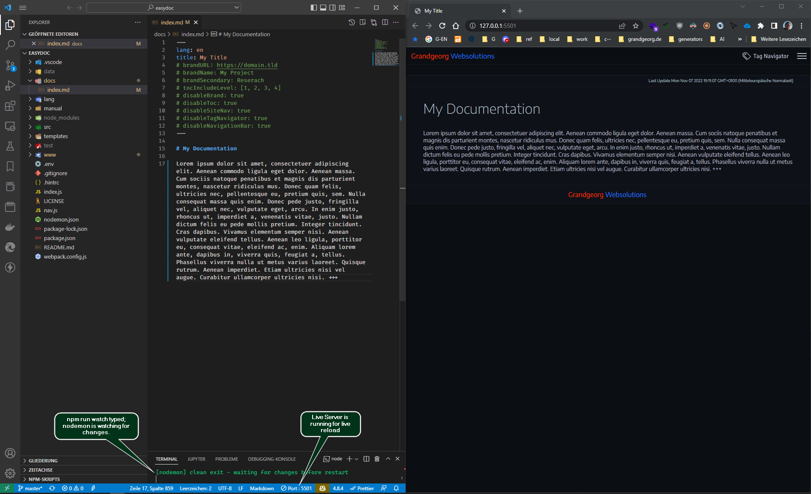

# EasyDoc {.text-center}


---
  
##### _created by:_ {.text-center}

<!-- BRAND HTML -->
<a class="brand-link" href="https://grandgeorg.de">
  <div class="brand">Grandgeorg</div>
  <div class="brand-second">Websolutions</div>
</a>

<svg width="156" height="84" viewBox="0 0 52 28" class="logo gw-logo" style="margin-top:0.5rem">
  <path style="fill:#ff3300;stroke:#bf260066;stroke-width:2px;stroke-linecap:butt;stroke-linejoin:round;stroke-opacity:1" d="M 24,4 H 4 V 24 H 24 V 12 h -8 v 4 h 4 v 4 H 8 V 8 h 16 z"/>
  <path style="fill:#267dff;stroke:#1d5ebf66;stroke-width:2px;stroke-linecap:butt;stroke-linejoin:round;stroke-opacity:1" d="M 48,4 V 24 H 28 V 4 h 4 v 16 h 4 V 8 h 4 v 12 h 4 V 4 Z" />
</svg>
<!-- :BRAND HTML -->

---

## Features

::: details Generates completely local HTML Website.
-	You can just open the resulting HTML-files in the ```www``` directory locally in a browser. 
-	You can also drop / push the contents of the ```www``` directory to a HTTP-Server.
:::

::: details Rich markdown support and code highlighting features
- Uses [markdown-it](https://github.com/markdown-it/markdown-it) with plugins for markdown to HTML rendering
- Uses [Prism](https://prismjs.com/) with plugins to highlight code.
:::

::: details Fully configurable and customizable
- Configure global and per page settings (see [reference](easydoc-reference.html) for details).
- Customize all components as you like.
- Edit SCSS files (under ```src/scss```) to change theme.
- Edit ```app.js``` to change navigation etc.
- ```app.js``` uses pure vanilla JavaScript without any dependencies.
:::

::: details Built in Navigation
- Table of contents on pages
- Individual site navigation
- Tag Navigator module
:::


## Install

Clone with git from [master branch](https://git.grandgeorg.de/Viktor/easydoc):

```bash
# clone via https:
git clone https://git.grandgeorg.de/Viktor/easydoc.git
# or clone via SSH (if you have a key):
git clone git@git.grandgeorg.de:Viktor/easydoc.git
```

Change into `easydoc` directory and run install:

```bash
cd ./easydoc/
npm install
```
You could now use EasyDoc from this directory, but we recommend, that for your documentations in different paths you use the ```setup.js``` from EasyDoc as follows:

```sh
# cd to some directory in some project of yours, where you want to setup your documentation with EasyDoc
cd /some/project/docs
# run setup.js from easydoc with node
node /path/where/you/cloned/and/installed/easydoc/setup.js
# edit newly generated config files (.env, nav.js, package.json - author, description, keywords) in /some/project/docs ...
# put some md-files into docs directory
# you can now run
npm run build
# if you also want to use nodemon to watch your file changes first run
npm install
# then you can run
npm run watch
```

## Usage

```bash
# watches on file changes and runs build:
npm run watch
# or build one time
npm run build
```

::: details 🖿 easydoc directory structure
```filetree
🗁 easydoc
 ├🗀 .git
 ├🗀 .vscode
 ├🟢 docs
 │ └🗏 index.md 🖤
 ├🗀 lang 🖊️
 ├🗁 manual 📌
 │ ├🗀 assets
 │ ├🗀 img
 │ ├🗏 easydoc.html
 │ ├🗏 easydoc.md
 │ ├🗏 reference.html
 │ └🗏 reference.md 
 ├🗀 node_modules
 ├🗀 setup 🖊️
 ├🗀 src 🖊️
 ├🗀 templates 🖊️
 ├🔵 www
 │ ├🗀 assets 🖊️
 │ ├🟢 img
 │ ├🗏 index.html 🖤
 │ └🗏 meta.js 🖤
 ├🗏 .env ✏️
 ├🗏 .gitignore
 ├🗏 .hintrc
 ├🗏 index.js 🖊️
 ├🗏 nav.js ✏️
 ├🗏 nodemon.json
 ├🗏 package.json
 ├🗏 package-lock.json
 └🗏 webpack.config.js

╭──────────────────────────═━┈💬┈━═──────────────────────────╮
│  🟢 input directories. Start creating files here.          │
│  🔵 output directory. Html files will be generated here.   │
│  ✏️ configure EasyDoc                                      │
│  🖊️ change EasyDoc                                         │
│  📌 It's me. You are reading these documents right now.    │
│  🖤 Remove these documentation files for a blank start.    │
╰──────────────────────────═━┈💬┈━═──────────────────────────╯
```
:::


--------------------------------------------------------------------------------
For configuration and further usage refer to the [EasyDoc Reference](easydoc-reference.html) {.text-center}

--------------------------------------------------------------------------------

## Workflow

For the most convenient use do the following:

1. Start [Visual Studio Code](https://code.visualstudio.com/) from the ```easydoc``` directory.
2. Start the [Live Server](https://marketplace.visualstudio.com/items?itemName=ritwickdey.LiveServer) extension.
3. Run ```npm run watch```.
4. Put the vscode and the browser window side by side.
5. Start creating and editing markdown files in ```docs``` directory.
6. Use git if working in a team.

::: details Workspace Example Screenshot

:::
